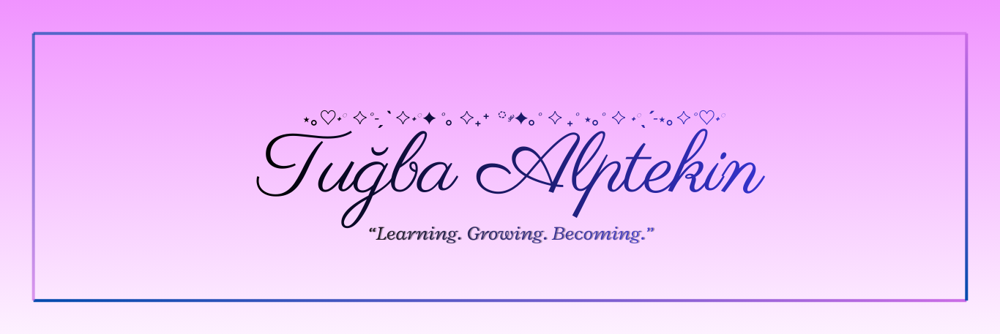

  

🌸 About Me

### <strong>Hi, I'm Tuğba — a detail-oriented Junior Business Analyst.</strong>

I love analyzing systems, simplifying complex processes, and designing clear, user-friendly solutions.  
My focus areas include requirements gathering, process modeling,
UX-oriented design thinking, and improving workflows with a structured, analytical approach.

I’m passionate about continuous learning, especially in:
**BPMN, UML, SQL, and API fundamentals.**

I believe a great Business Analyst connects:

✨ people  
✨ processes  
✨ technology  

to create meaningful improvements.

---
 
⎛⎝ ≽ > ⩊ < ≼ ⎠⎞

<em>🎀You can view my Business Analyst portfolio through the link below.⤶</em>

  

 

## 👨🏻‍💻 Tech Stack

 

### 🎨 Tools & Design

  
  
  
  

### 🧩 Analysis & Modeling  
- BPMN 2.0 (process modeling)  
- UML (Use Case, Activity, Sequence)  
- Process Mapping  
- Business Rules Documentation  
- Wireframing & UI/UX Sketches  

### 🗄️ Technical  
- SQL (Basic Queries)  
- API Fundamentals  
- JSON & XML Basics  
- Data-oriented thinking  

### 🔧 Collaboration  
- Agile / Scrum  
- Requirement Elicitation  
- Acceptance Criteria Writing  

---
 

## 📊 GitHub Statistics

  

  

---
 

## 📚 Currently Learning
- Advanced SQL  
- API Testing  
- BPMN Deep Dive

---

## 🌐 Let's Connect

  
  

